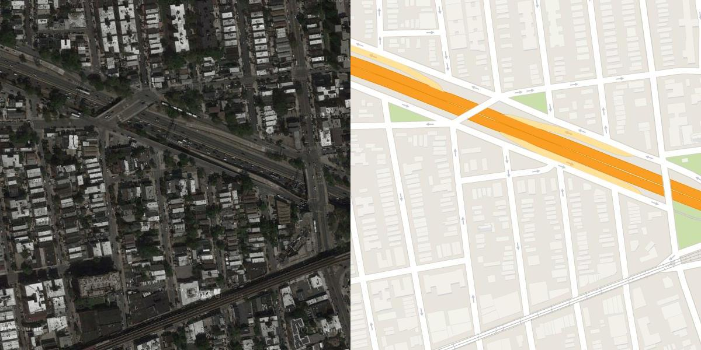
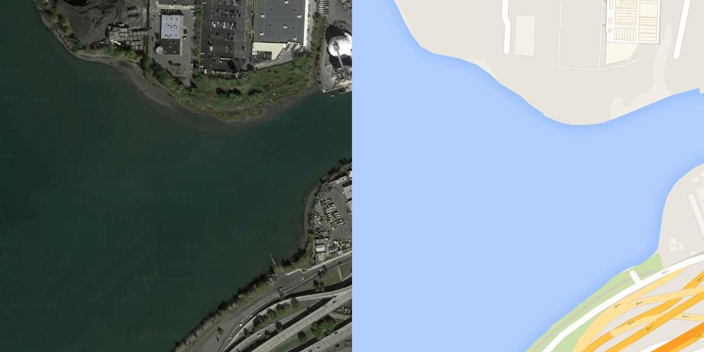

# CGAN para geração de mapas padrão com base em imagens via Satelite

Este projeto utiliza uma **Rede Adversária Generativa Condicional (CGAN)** para **gerar mapas estilizados** (como mapas de ruas, topográficos ou padrão OpenStreetMap) **a partir de imagens de satélite**. O objetivo é explorar como modelos GAN podem aprender a converter dados visuais complexos em representações simplificadas e úteis para navegação, análise urbana e planejamento geográfico.

## Motivação

Mapas são fundamentais para nossa compreensão do espaço geográfico, mas sua criação exige muito trabalho manual ou acesso a bancos de dados estruturados. Com a crescente disponibilidade de **imagens de satélite de alta resolução**, surge a oportunidade de **automatizar a geração de mapas** com técnicas de **inteligência artificial**.

Este projeto propõe o uso de uma CGAN para aprender a relação entre imagens de satélite e seus respectivos mapas, permitindo a conversão automática com qualidade visual e semântica.

---

## Tecnologias utilizadas

- Python 3.10+
- TensorFlow / keras
- NumPy
- Matplotlib
- Ipython

---

## Arquitetura da CGAN

A CGAN é composta por dois módulos principais:

- **Gerador (Generator)**: para geração de imagens, foi escolhido o modelo U-net. esse modelo Recebe uma imagem de satélite + um ruído para gerar imagens, nesse caso, gerar imagens de mapas.
- **Discriminador (Discriminator)**: para classificação das imagens, foi escolhido o modelo patchGAN. esse modelo Tenta distinguir entre mapas reais e mapas gerados, aprendendo a identificar falsificações.

escolhi esses modelos para que não houvesse injustiças no treinamento. um modelo melhor que o outro poderia trazer resultados enviesados.

---

## Estrutura do Projeto

o Código foi desenvolvido com jupyter, o dataset esta disponivel no link abaixo: 
http://efrosgans.eecs.berkeley.edu/pix2pix/datasets/ 
para o modelo gerador, utilizo o modelo U-net, e para o modelo discriminador, utilizo o patchGAN. ambos modelos apresentam resultados parecidos em suas respectivas funções.
para o treinamento e validação, utilizo 1096 imagens, cada imagem apresenta dois modelos de mapas, um modelo via satelite e ao lado o modelo padrão para comparação:

